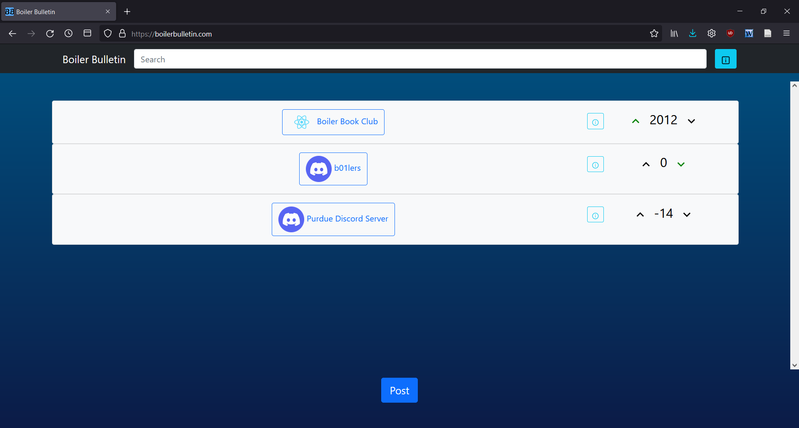
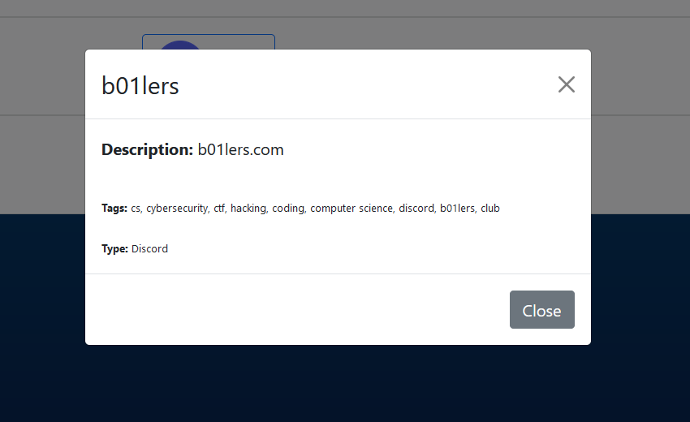
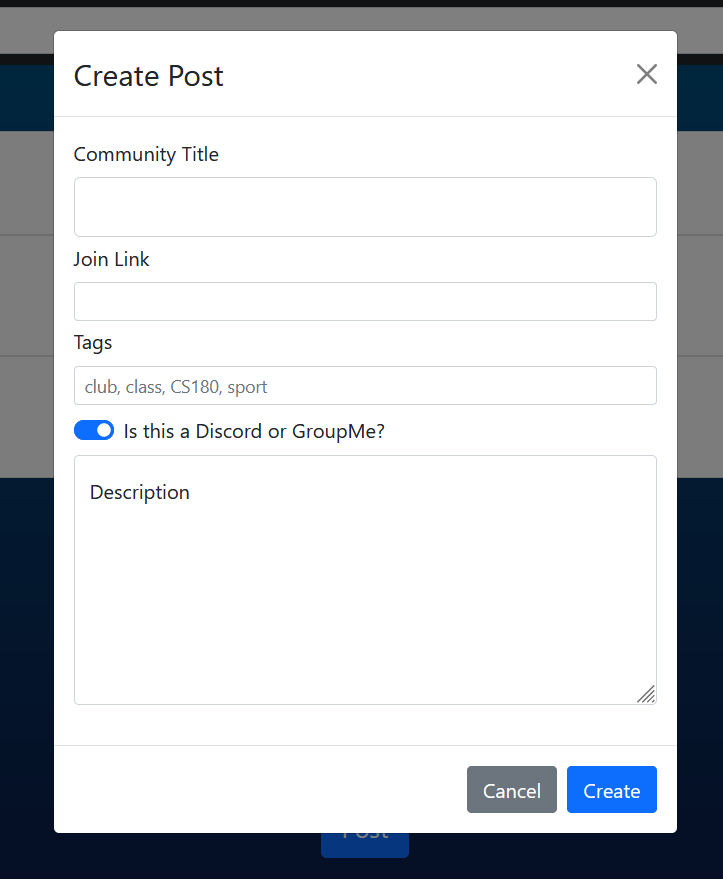

# Boiler Bulletin

An aggregator for communities of Boilers, maintained and developed by Purdue students.

Users can:

- Post links to online communities for all things Purdue related
- Browse, filter, and sort through other communities
- Upvote and downvote posts accordingly

## Developed by

- Kai Tinkess
- Alex Hunton

for [BoilerMake 2022](https://boilermake.org/)

[DevPost](https://devpost.com/software/boiler-bulletin)

## Built With

- React
- create-react-app
- Bootstrap
- Firebase

* * *

## Screenshots

